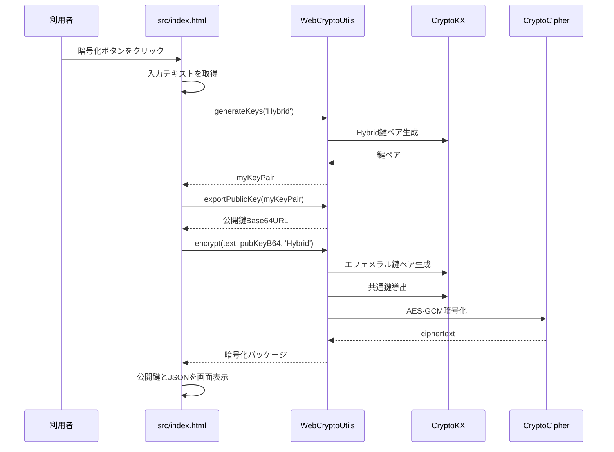
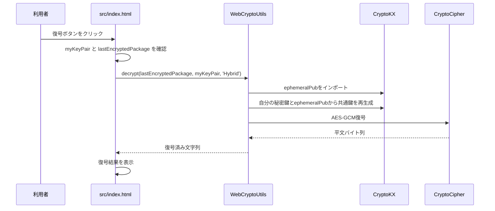

# `src/index.html` 詳細解説

このドキュメントは、`src/index.html` に対応するサンプル説明書です。  
`webcrypto-utils-js` を使って、ブラウザ上で「鍵生成 → 公開鍵の表示 → 暗号化パッケージ生成 → 復号確認」までを実行するデモの構成、操作手順、内部処理、注意点を説明します。

---

## 1. このサンプルの目的

`src/index.html` は、`webcrypto-utils-js` の高レベルAPIである `WebCryptoUtils` を使い、エンドツーエンド暗号化の基本的な流れをブラウザ上で確認するためのデモです。

このサンプルでは、次の処理を順に確認できます。

1. 暗号化したいメッセージを入力する
2. Hybrid方式の鍵ペアを生成する
3. 生成された公開鍵をBase64URL文字列として表示する
4. その公開鍵宛てにメッセージを暗号化する
5. 暗号化パッケージをJSONとして表示する
6. 自分の秘密鍵を使って復号し、元のメッセージを確認する

デモでは説明を単純にするため、「自分で生成した公開鍵に対して、自分自身が暗号化メッセージを送る」形になっています。実運用では、受信者が公開鍵を発行し、送信者がその公開鍵を使って暗号化し、受信者が自分の秘密鍵で復号します。

---

## 2. ファイル構成との対応

このサンプルに関係する主なファイルは次のとおりです。

```text
webcrypto-utils-js/
├─ README.md
├─ src.md        ← この説明ファイル
└─ src/
   ├─ index.html
   ├─ webcrypto-utils.js
   ├─ kx.js
   ├─ cipher.js
   ├─ hash.js
   └─ utils.js
```

各ファイルの役割は次のとおりです。

| ファイル | 役割 |
|---|---|
| `src/index.html` | 画面UIとデモ実行ロジック |
| `src/webcrypto-utils.js` | 鍵生成・公開鍵エクスポート・暗号化・復号をまとめた高レベルAPI |
| `src/kx.js` | X25519、P-256、P-521、Hybrid ML-KEM鍵交換処理 |
| `src/cipher.js` | AES-GCMによる暗号化・復号 |
| `src/hash.js` | SHA-512、HKDF、HKDF polyfill |
| `src/utils.js` | Base64URL変換、UTF-8変換、バイト列結合、定数定義 |

---

## 3. 実行前の重要な注意点

---

### 3.1 `file://` ではなくローカルHTTPサーバーで開く

このサンプルは ES Modules を使っています。ブラウザで `index.html` を直接ダブルクリックして `file://` として開くと、モジュール読み込みで失敗することがあります。

次のようにローカルHTTPサーバーで起動してください。

```bash
cd webcrypto-utils-js
python -m http.server 8000
```

その後、ブラウザで次を開きます。

```text
http://localhost:8000/src/
```

---

### 3.2 Hybrid方式を使う場合のML-KEM初期化

`src/index.html` では、次のように Hybrid方式を指定しています。

```js
myKeyPair = await WebCryptoUtils.generateKeys('Hybrid');
```

一方、現在の `src/kx.js` では、ML-KEMモジュールは `CryptoKX.detectCapabilities()` の中で動的に読み込まれます。

```js
const m = await import('https://esm.sh/mlkem');
```

そのため、`detectCapabilities()` を呼ばずに `generateKeys('Hybrid')` を実行すると、次のようなエラーになる可能性があります。

```text
ML-KEM module not loaded
```

Hybridデモとして動かす場合は、暗号化処理の前にML-KEMモジュールを初期化する処理を追加する必要があります。

例：

```js
import { WebCryptoUtils } from './webcrypto-utils.js';
import { CryptoKX } from './kx.js';

await CryptoKX.detectCapabilities();
```

ただし、`https://esm.sh/mlkem` から動的インポートするため、ブラウザが外部ネットワークにアクセスできる必要があります。また、CSPを設定している環境では、外部モジュールの読み込みがブロックされることがあります。

---

## 4. 画面構成

`src/index.html` の画面は、大きく2段階に分かれています。

### 4.1 初期表示

初期状態では、次のUIだけが表示されます。

- タイトル：`webcrypto-utils-js 動作デモ`
- 説明文：Hybrid PQCを使ったE2EEシミュレーションであること
- メッセージ入力欄
- 暗号化実行ボタン

対応するHTML要素は次のとおりです。

| 要素 | id | 内容 |
|---|---|---|
| メッセージ入力欄 | `msg-input` | 暗号化したいテキスト |
| 暗号化ボタン | `encrypt-btn` | 鍵生成と暗号化を実行 |

初期値として、次のメッセージが入力されています。

```text
これは秘密のメッセージです（耐量子ハイブリッド暗号テスト）
```

---

### 4.2 暗号化後に表示される領域

暗号化が成功すると、`demo-steps` の表示が `block` になり、次の情報が表示されます。

| 表示項目 | id | 内容 |
|---|---|---|
| 生成された公開鍵 | `pubkey-out` | Base64URL形式の公開鍵 |
| 暗号化パッケージ | `packet-out` | JSON形式の暗号化データ |
| 復号ボタン | `decrypt-btn` | 復号処理を実行 |
| 復号結果 | `decrypted-result` | 復号された元メッセージ |

---

## 5. 暗号化フロー

暗号化ボタンを押すと、次の処理が実行されます。

```js
encryptBtn.addEventListener('click', async () => {
    ...
});
```

処理の流れは次のとおりです。



---

### 5.1 ボタン状態の変更

処理開始時にボタンを無効化し、二重クリックを防止します。

```js
encryptBtn.disabled = true;
encryptBtn.textContent = "処理中...";
```

処理終了後、`finally` で必ず元に戻します。

```js
encryptBtn.disabled = false;
encryptBtn.textContent = "鍵ペアを生成して暗号化を実行";
```

---

### 5.2 入力メッセージの取得

入力欄から暗号化対象の文字列を取得します。

```js
const text = document.getElementById('msg-input').value;
```

この時点では、まだ暗号化されていない通常の文字列です。

---

### 5.3 鍵ペア生成

次の処理で、自分の鍵ペアを生成します。

```js
myKeyPair = await WebCryptoUtils.generateKeys('Hybrid');
```

`WebCryptoUtils.generateKeys('Hybrid')` は、内部的には `Hybrid-MLKEM-768` を指定して鍵交換用の鍵を生成します。

```js
const isHybrid = type === 'Hybrid';
return await CryptoKX.genECDH(isHybrid ? 'Hybrid-MLKEM-768' : 'X25519', true);
```

Hybrid方式では、次の要素を組み合わせます。

| 要素 | 目的 |
|---|---|
| X25519 | 楕円曲線Diffie-Hellmanによる鍵共有 |
| ML-KEM-768 | 耐量子計算機暗号方式による鍵カプセル化 |
| HKDF-SHA-512 | X25519とML-KEMの共有秘密を結合し、AES鍵を導出 |
| AES-GCM | 実際のメッセージ暗号化 |

---

### 5.4 公開鍵のエクスポート

生成した鍵ペアから、相手に渡せる公開鍵文字列を作成します。

```js
const pubKeyB64 = await WebCryptoUtils.exportPublicKey(myKeyPair);
```

内部的には、公開鍵をraw形式のバイト列として取り出し、Base64URL形式に変換します。

```js
const raw = await CryptoKX.exportPubRaw(keyPair);
return Utils.b64urlEncode(raw);
```

この公開鍵は、暗号化する側が利用します。秘密鍵は外部に渡してはいけません。

---

### 5.5 自分の公開鍵宛てに暗号化

デモでは、次のように自分自身の公開鍵宛てに暗号化しています。

```js
lastEncryptedPackage = await WebCryptoUtils.encrypt(text, pubKeyB64, 'Hybrid');
```

実際の利用では、ここで渡す `pubKeyB64` は「受信者の公開鍵」です。

`encrypt()` の内部では、次の処理が行われます。

1. 入力文字列をUTF-8バイト列に変換する
2. 受信者公開鍵をBase64URLからバイト列に戻す
3. 送信用のエフェメラル鍵ペアを生成する
4. 受信者公開鍵と送信者エフェメラル秘密鍵から共有秘密を生成する
5. `nonce` をsaltとしてHKDFでAES鍵を導出する
6. ランダムな `iv` を生成する
7. AES-GCMで平文を暗号化する
8. 暗号化パッケージをJSON互換オブジェクトとして返す

---

## 6. 暗号化パッケージの形式

`WebCryptoUtils.encrypt()` は、次の形式のオブジェクトを返します。

```js
{
  ciphertext: "...",
  ephemeralPub: "...",
  nonce: "...",
  iv: "..."
}
```

各項目の意味は次のとおりです。

| 項目 | 内容 | 秘密情報か |
|---|---|---|
| `ciphertext` | AES-GCMで暗号化された本文。認証タグも含む | いいえ。ただし秘匿対象データ |
| `ephemeralPub` | 送信者が暗号化時に生成した一時公開鍵 | いいえ |
| `nonce` | HKDFでAES鍵を導出するときに使うsalt | いいえ |
| `iv` | AES-GCMの初期化ベクトル | いいえ |

これらは通信路上やサーバー上に保存されるデータです。  
ただし、復号には受信者の秘密鍵が必要です。

---

## 7. 復号フロー

復号ボタンを押すと、次の処理が実行されます。

```js
decryptBtn.addEventListener('click', async () => {
    ...
});
```

処理の流れは次のとおりです。



---

### 7.1 復号前の状態確認

暗号化がまだ実行されていない場合は、復号できません。

```js
if (!myKeyPair || !lastEncryptedPackage) return;
```

このサンプルでは、秘密鍵を含む `myKeyPair` と、直前に生成した `lastEncryptedPackage` をJavaScript変数として保持しています。

---

### 7.2 復号の実行

復号処理は次の1行で行われます。

```js
const originalText = await WebCryptoUtils.decrypt(lastEncryptedPackage, myKeyPair, 'Hybrid');
```

`decrypt()` の内部では、次の処理が行われます。

1. `ephemeralPub` をBase64URLからバイト列に戻す
2. `nonce`、`iv`、`ciphertext` をBase64URLからバイト列に戻す
3. 自分の秘密鍵と相手のエフェメラル公開鍵から共有秘密を再生成する
4. `nonce` をsaltとしてHKDFでAES鍵を再導出する
5. AES-GCMで `ciphertext` を復号する
6. 復号したバイト列をUTF-8文字列に戻す

成功すると、元の入力メッセージが `decrypted-result` に表示されます。

---

## 8. `WebCryptoUtils` APIとの対応

`src/index.html` で使用しているAPIは次の4つです。

### 8.1 `generateKeys(type)`

```js
const myKeyPair = await WebCryptoUtils.generateKeys('Hybrid');
```

鍵ペアを生成します。

| 引数 | 内容 |
|---|---|
| `'Hybrid'` | X25519 + ML-KEM-768 のハイブリッド方式 |
| `'X25519'` | X25519のみの方式 |

戻り値は秘密鍵を含むため、外部に送信・保存する場合は取り扱いに注意が必要です。

---

### 8.2 `exportPublicKey(keyPair)`

```js
const pubKeyB64 = await WebCryptoUtils.exportPublicKey(myKeyPair);
```

鍵ペアから公開鍵を取り出し、Base64URL文字列として返します。

この値は相手に渡せます。  
この値だけでは復号できません。

---

### 8.3 `encrypt(text, recipientPubB64, algoName)`

```js
const encrypted = await WebCryptoUtils.encrypt(text, pubKeyB64, 'Hybrid');
```

文字列を暗号化します。

| 引数 | 内容 |
|---|---|
| `text` | 暗号化する文字列 |
| `recipientPubB64` | 受信者の公開鍵 |
| `algoName` | `'Hybrid'` または `'X25519'` |

戻り値は、通信や保存に使える暗号化パッケージです。

---

### 8.4 `decrypt(encryptedPackage, myKeyPair, algoName)`

```js
const text = await WebCryptoUtils.decrypt(encryptedPackage, myKeyPair, 'Hybrid');
```

暗号化パッケージを、自分の秘密鍵で復号します。

| 引数 | 内容 |
|---|---|
| `encryptedPackage` | `encrypt()` が返したオブジェクト |
| `myKeyPair` | 自分の秘密鍵を含む鍵ペア |
| `algoName` | 暗号化時と同じ方式 |

暗号化時と異なる方式を指定した場合や、別人の秘密鍵を使った場合は復号に失敗します。

---

## 9. このサンプルで確認できること

このサンプルでは、次のことを確認できます。

- ブラウザ上で鍵ペアを生成できること
- 公開鍵を文字列化して画面表示できること
- 公開鍵宛てにメッセージを暗号化できること
- 暗号文、エフェメラル公開鍵、nonce、ivをまとめたパッケージを作れること
- 秘密鍵を持つ側だけが復号できること
- 復号後の文字列が元の入力と一致すること

---

## 10. このサンプルで確認できないこと

このサンプルはあくまでブラウザ内のローカルデモです。次の要素は含まれていません。

- サーバーへのアップロード
- 受信者との公開鍵交換
- ユーザー認証
- 公開鍵の本人確認
- 署名・検証
- 鍵の永続化
- 秘密鍵のバックアップ
- 複数端末同期
- メッセージ改ざん検出用の追加メタデータ設計
- 鍵ローテーション
- 失効管理

したがって、このサンプルだけで本番用E2EEシステムが完成するわけではありません。  
本番設計では、公開鍵の真正性確認、秘密鍵の保管、署名、鍵更新、アカウント復旧、サーバー側メタデータの扱いなどを別途設計する必要があります。

---

## 11. セキュリティ上の注意

### 11.1 秘密鍵はJavaScriptメモリ上に保持される

このサンプルでは、生成した鍵ペアを次の変数に保持しています。

```js
let myKeyPair = null;
```

これはブラウザのメモリ上に存在します。ページをリロードすると消えます。  
本番環境では、秘密鍵をIndexedDB、WebAuthn、OSキーストア、外部トークンなどにどう保存するかを検討する必要があります。

---

### 11.2 公開鍵の本人確認はしていない

E2EEでは、公開鍵そのものは秘密ではありません。  
しかし、「その公開鍵が本当に相手のものか」は別問題です。

このサンプルでは、公開鍵の真正性確認は行っていません。  
実運用では、次のような仕組みが必要になります。

- 公開鍵フィンガープリントの確認
- QRコードによる対面確認
- 署名付き公開鍵
- サーバーによる公開鍵配布履歴の監査
- 鍵変更時の警告

---

### 11.3 「Forward Secrecy 有効」の表示について

画面には次の表示があります。

```text
✓ 暗号化完了 (Forward Secrecy 有効)
```

ただし、このサンプルは受信者の長期公開鍵に対して、送信者側がエフェメラル鍵を使って暗号化する構成です。  
この構成では、送信者側の一時鍵を使い捨てることにより、鍵の再利用は避けられます。

一方で、過去の暗号化パッケージを攻撃者が保存しており、後日、受信者の長期秘密鍵が漏洩した場合、過去メッセージを復号できる可能性があります。  
そのため、厳密な意味での完全なForward Secrecyと表現するには注意が必要です。

より厳密なForward Secrecyを実現するには、セッションごとの鍵更新、Double Ratchetのようなラチェット機構、短命な受信側鍵など、追加のプロトコル設計が必要です。

---

### 11.4 AADは空である

AES-GCMでは、暗号化対象とは別にAAD、つまり追加認証データを指定できます。  
現在の実装では、AADは空です。

```js
new Uint8Array(0)
```

本番環境では、次のようなメタデータをAADに含める設計が考えられます。

- プロトコルバージョン
- 送信者ID
- 受信者ID
- ファイルID
- 作成時刻
- アルゴリズム識別子
- 鍵ID

AADに含めた値は暗号化されませんが、改ざんされると復号に失敗します。

---

### 11.5 外部CDNからML-KEMを読み込む設計

`kx.js` は、Hybrid方式のために次の外部モジュールを動的に読み込む想定です。

```js
await import('https://esm.sh/mlkem');
```

デモとしては簡便ですが、本番環境では次の点を検討してください。

- バージョン固定
- Subresource Integrity相当の検証
- ビルド時バンドル
- CDN障害時の挙動
- サプライチェーン攻撃対策
- CSPとの整合性

---

## 12. よくあるエラーと対処

### 12.1 `Failed to resolve module specifier` または `404`

原因：`src/index.html` の import パスが実ファイル配置と合っていません。

対処：

```js
import { WebCryptoUtils } from '../src/webcrypto-utils.js';
```

に変更するか、`src/` 内のJSファイルを `src/` にコピーします。

---

### 12.2 `ML-KEM module not loaded`

原因：`CryptoKX.detectCapabilities()` を呼ぶ前にHybrid鍵生成を実行しています。

対処：暗号化処理前に次を実行します。

```js
await CryptoKX.detectCapabilities();
```

また、`CryptoKX` をimportする必要があります。

```js
import { CryptoKX } from '../src/kx.js';
```

---

### 12.3 `crypto.subtle` が使えない

原因：WebCrypto APIは、通常、安全なコンテキストで利用する必要があります。

対処：

- `http://localhost` で実行する
- HTTPSで配信する
- 古いブラウザを避ける

---

### 12.4 復号に失敗する

主な原因は次のとおりです。

- 暗号化時と復号時のアルゴリズム指定が異なる
- `lastEncryptedPackage` の内容が壊れている
- `myKeyPair` が暗号化対象の公開鍵に対応していない
- `nonce`、`iv`、`ciphertext`、`ephemeralPub` のいずれかが改変された
- ML-KEMの公開鍵長または暗号文長が想定と異なる

---

## 13. 最小修正版の例

現在の構成のまま `src/` を参照し、Hybrid初期化も行う場合、`src/index.html` の `<script type="module">` 冒頭は次のようにするのが分かりやすいです。

```js
import { WebCryptoUtils } from '../src/webcrypto-utils.js';
import { CryptoKX } from '../src/kx.js';

const availableAlgos = await CryptoKX.detectCapabilities();

if (!availableAlgos.includes('Hybrid-MLKEM-768')) {
    console.warn('Hybrid-MLKEM-768 is not available in this environment.');
}
```

さらに、Hybridが使えない環境でもデモを続けたい場合は、X25519へフォールバックする設計にできます。

```js
const preferredMode = availableAlgos.includes('Hybrid-MLKEM-768') ? 'Hybrid' : 'X25519';
```

その場合、鍵生成・暗号化・復号で同じ `preferredMode` を使います。

```js
myKeyPair = await WebCryptoUtils.generateKeys(preferredMode);
lastEncryptedPackage = await WebCryptoUtils.encrypt(text, pubKeyB64, preferredMode);
const originalText = await WebCryptoUtils.decrypt(lastEncryptedPackage, myKeyPair, preferredMode);
```

---

## 14. 本番利用へ進める場合の拡張ポイント

このサンプルを本番向けに拡張する場合、少なくとも次の点を検討してください。

### 14.1 鍵管理

- 秘密鍵の保存先
- 秘密鍵のエクスポート可否
- 鍵バックアップ
- 端末紛失時の復旧
- 鍵のローテーション
- 鍵の失効

### 14.2 公開鍵配布

- 公開鍵の登録
- 公開鍵の本人確認
- 公開鍵変更時の警告
- 鍵IDの付与
- 古い鍵との互換性

### 14.3 署名

このサンプルは暗号化と復号だけを扱います。  
送信者の本人性や改ざん検出をより明確にするには、電子署名を追加する設計が必要です。

検討例：

- ファイルまたはメッセージ本文への署名
- 公開鍵への署名
- 署名鍵と暗号鍵の分離
- 署名検証結果のUI表示

### 14.4 サーバー連携

暗号化パッケージをサーバーに保存する場合でも、サーバーは秘密鍵を持たない設計にします。

サーバーが保持する可能性がある情報：

- 暗号化パッケージ
- 送信者ID
- 受信者ID
- 鍵ID
- ファイル名の暗号化済みデータ
- 有効期限
- アクセスログ

注意すべき点：

- メタデータから情報が漏れる可能性
- ファイルサイズや送信時刻から推測される可能性
- URL共有時の権限管理
- 受信者の鍵変更への対応

---

## 15. デモの位置づけ

この `src/index.html` は、`webcrypto-utils-js` のAPIを短時間で理解するための最小デモです。

特に、次の流れを確認する目的に向いています。

```text
鍵を作る
  ↓
公開鍵を渡せる形にする
  ↓
公開鍵で暗号化する
  ↓
暗号化パッケージを保存・送信できる形にする
  ↓
秘密鍵で復号する
```

この流れを理解すると、チャット、ファイル共有、フォーム送信、機密メモ、E2EEストレージなどへ応用しやすくなります。

---

## 16. まとめ

`src/index.html` は、`WebCryptoUtils` の基本的な使い方を確認するためのブラウザデモです。

重要なポイントは次のとおりです。

- 入力した文字列をブラウザ上で暗号化する
- 公開鍵は相手に渡せるが、秘密鍵は渡してはいけない
- 暗号化パッケージには、暗号文、エフェメラル公開鍵、nonce、ivが含まれる
- 復号には、対応する秘密鍵が必要である
- 現在のZIP構成では import パス修正またはJSファイルコピーが必要である
- Hybrid方式を使うには、ML-KEMモジュールの初期化が必要である
- 本番利用には、鍵管理、公開鍵検証、署名、サーバー設計を追加で検討する必要がある

このサンプルは、E2EEの仕組みをUI上で見える形にするための入口として有用です。  
一方で、セキュリティプロトコル全体としてはまだ最小構成であり、本番利用では周辺設計を慎重に追加する必要があります。
